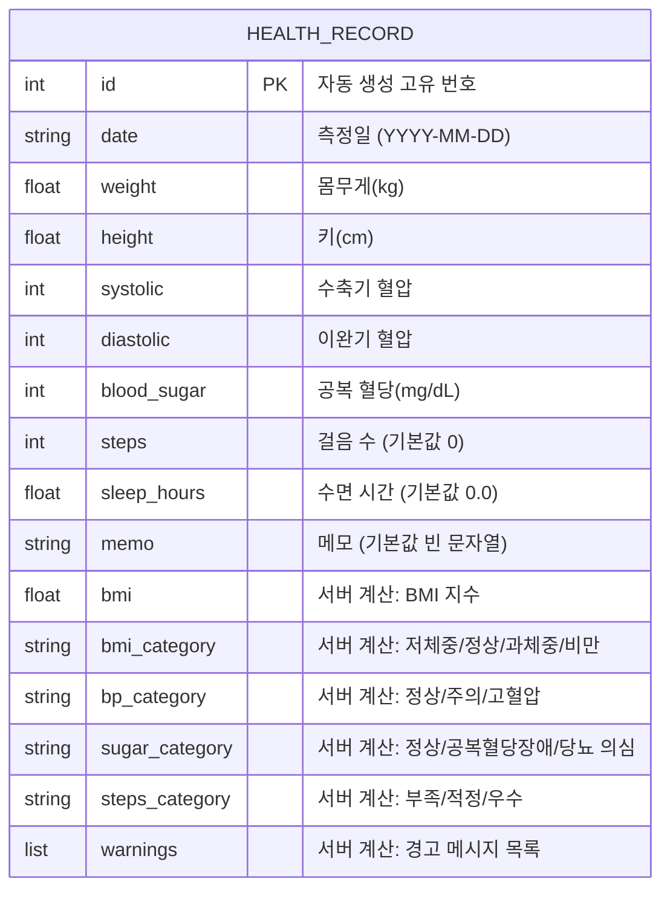

# ERD (Entity Relationship Diagram)
## 마이 헬스 로그 API

---

## 1. 개요

이 프로젝트는 별도의 데이터베이스 없이 **JSON 파일(`data.json`)**을 저장소로 사용하며, 데이터 구조는 `HealthRecord`(건강 기록) **단일 개체(Entity)**로 구성된다. 사용자 구분이나 다른 테이블과의 관계가 없는 단순 구조이므로, 하나의 개체 안에 "사용자 입력 필드"와 "서버 계산 필드"가 함께 존재하는 형태로 설계하였다.

---

## 2. ERD 다이어그램



> GitHub에서 이 파일을 열면 위 코드가 자동으로 표(개체-속성) 다이어그램 형태로 렌더링됩니다.

---

## 3. 필드 상세 설명

### 3.1 사용자 입력 필드 (요청 시 클라이언트가 보내는 값)

| 필드명 | 타입 | 제약조건 | 설명 |
|---|---|---|---|
| date | string | 필수 | 측정일 |
| weight | float | 필수 | 몸무게(kg) |
| height | float | 필수 | 키(cm) |
| systolic | int | 필수 | 수축기 혈압 |
| diastolic | int | 필수 | 이완기 혈압 |
| blood_sugar | int | 필수 | 공복 혈당 |
| steps | int | 선택 (기본값 0) | 걸음 수 |
| sleep_hours | float | 선택 (기본값 0.0) | 수면 시간 |
| memo | string | 선택 (기본값 "") | 메모 |

### 3.2 서버 계산 필드 (응답 시 자동으로 추가되는 값)

| 필드명 | 타입 | 계산 근거 |
|---|---|---|
| id | int | 저장 순서에 따라 자동 부여 (Primary Key 역할) |
| bmi | float | weight ÷ (height/100)² |
| bmi_category | string | bmi 값을 기준표에 따라 분류 |
| bp_category | string | systolic, diastolic 값을 기준표에 따라 분류 |
| sugar_category | string | blood_sugar 값을 기준표에 따라 분류 |
| steps_category | string | steps 값을 기준표에 따라 분류 |
| warnings | list[string] | bmi_category/bp_category/sugar_category가 위험 범위일 때 생성 |

---

## 4. 저장 구조 (물리적 저장 형태)

관계형 데이터베이스의 테이블 대신, `data.json` 파일 안에 `HEALTH_RECORD` 개체의 배열(리스트) 형태로 저장된다.

```json
[
  {
    "id": 1,
    "date": "2026-07-20",
    "weight": 65.0,
    "height": 170.0,
    "systolic": 118,
    "diastolic": 75,
    "blood_sugar": 90,
    "steps": 5000,
    "sleep_hours": 7.0,
    "memo": "",
    "bmi": 22.5,
    "bmi_category": "정상",
    "bp_category": "정상",
    "sugar_category": "정상",
    "steps_category": "적정",
    "warnings": []
  }
]
```

---

## 5. 설계 노트

- 본 프로젝트는 사용자 인증/구분 기능이 없는 개인 학습용 API이므로, 사용자(User)와 기록(Record) 간의 1:N 관계를 별도로 두지 않고 `HEALTH_RECORD` 단일 개체로 단순화하였다.
- `id`는 관계형 데이터베이스의 Primary Key와 동일한 역할을 하며, 리스트 내 저장 순서(`len(records) + 1`)를 기준으로 자동 부여된다.
- 추후 다중 사용자 기능(과제 6 추가 도전 항목 중 "사용자 구분")을 확장할 경우, `USER` 개체를 추가하고 `USER ||--o{ HEALTH_RECORD : "1:N"` 관계로 확장 가능하다.
