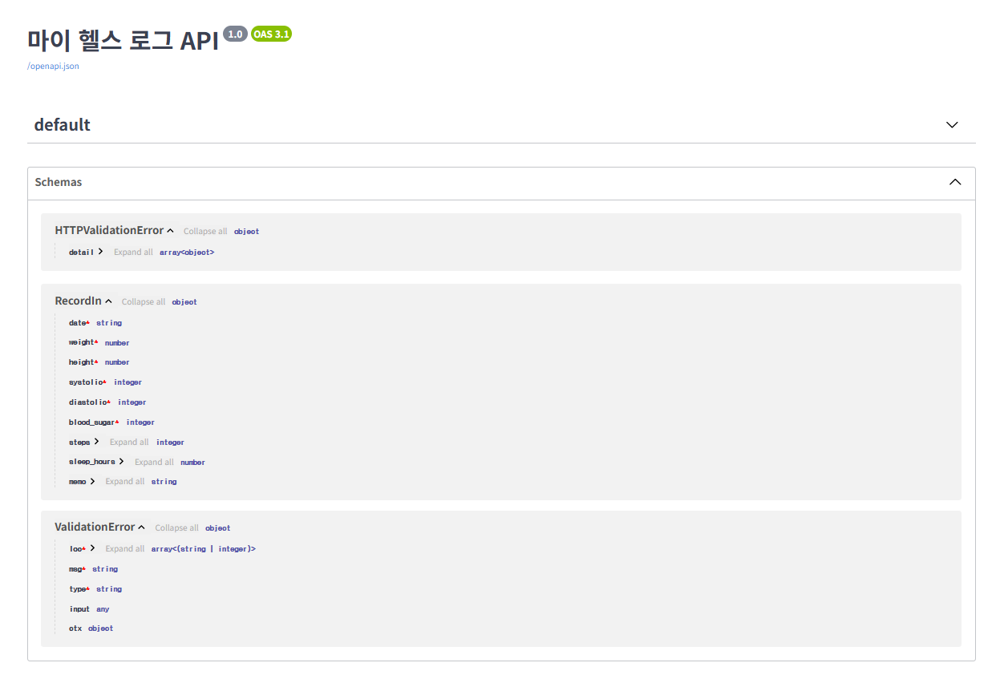
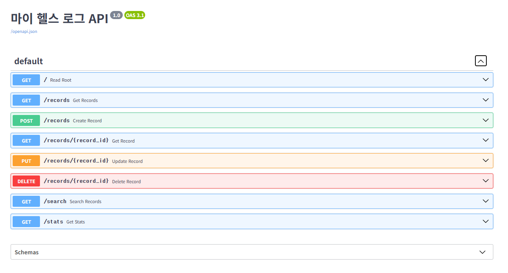
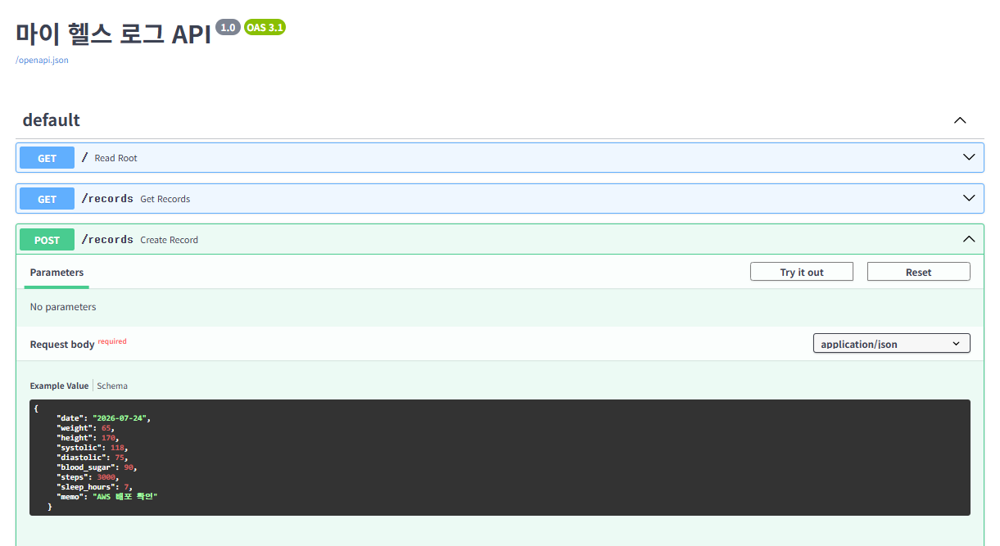

# 마이 헬스 로그 API

매일의 건강 수치(몸무게, 키, 혈압, 혈당 등)를 기록하면 BMI를 자동 계산하고 건강 상태를 분류해주는 API입니다. 기록을 누적해서 검색하고 통계도 확인할 수 있습니다.

## 기능 목록

| 메서드 | 경로 | 설명 |
|---|---|---|
| POST | /records | 건강 기록 추가 (BMI/분류/경고 자동 계산) |
| GET | /records | 전체 기록 조회 |
| GET | /records/{id} | 기록 단건 조회 |
| PUT | /records/{id} | 기록 수정 |
| DELETE | /records/{id} | 기록 삭제 |
| GET | /search | 날짜 범위로 기록 검색 |
| GET | /stats | 평균 체중, 평균 BMI 등 통계 조회 |
## 추가 구현 기능 (선택 과제)

- **걸음 수 활동량 등급**: 하루 걸음 수를 기준으로 활동량을 "부족(5,000 미만) / 적정(5,000~9,999) / 우수(10,000 이상)" 세 단계로 자동 분류하여 응답에 포함합니다. (POST /records, PUT /records/{id} 응답의 `steps_category` 필드로 확인 가능)

- **간단 웹 화면**: HTML 한 페이지(`/ui`)에서 건강 기록을 입력하고, 전체 기록을 표 형태로 조회할 수 있는 화면을 구현했습니다. 저장 시 BMI/혈압/혈당/활동량 분류 결과가 색상 뱃지로 표시되며, 위험 범위에 해당하면 경고 메시지가 함께 나타납니다. (접속: `/ui/`)

## 실행 방법

### 로컬 실행

\`\`\`bash
python -m venv venv
source venv/Scripts/activate
pip install -r requirements.txt
uvicorn main:app --reload
\`\`\`

실행 후 `http://127.0.0.1:8000/docs` 접속

### Docker 실행

\`\`\`bash
docker build -t my-health-api .
docker run -p 8000:8000 my-health-api
\`\`\`

실행 후 `http://127.0.0.1:8000/docs` 접속

## 기술 스택

- Python 3.11
- FastAPI
- Pydantic
- Uvicorn
- Docker

## 참고

건강 분류 기준은 학습용으로 단순화된 값이며, 실제 의학적 진단이 아닙니다.

## 배포 접속 URL

http://13.209.42.155:8000/docs

## 화면 캡처

### screenshots-1

### screenshots-2

### screenshots-3

